# Understanding Multi-Sig Approval & Auto-Release with Oracles in SynLedger
Multi-Sig Approval & Auto-Release with Oracles means that SynLedger can **securely manage payments either through collective human agreement or through verified external events** — combining **trust** and **automation** in a single escrow system.
> Multi-Sig Approval & Auto-Release with Oracles is part of SynLedger’s Core Concepts.

### High-Level System Overview
<!--  -->
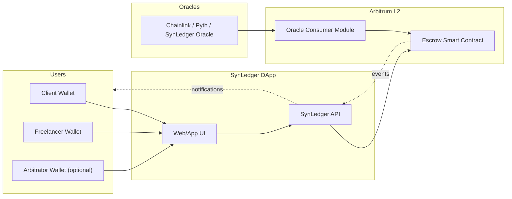

---

## Meaning

In the context of **SynLedger**, Multi-Sig Approval & Auto-Release with Oracles means:

> Once a client has funded the escrow, **the release of those funds** can happen in one of two ways:  
> either **manually approved by multiple authorized wallets** (*multi-sig approval*),  
> or **automatically released when an on-chain/off-chain condition is verified** (*auto-release via oracle*).

These two options allow SynLedger to support both **human trust workflows** and **automated programmable payments**.

<!--  -->
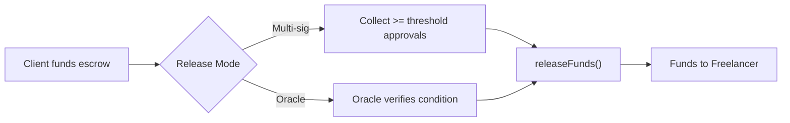

---

## 1. Multi-Sig Approval

### Definition
Multi-signature (multi-sig) approval means that **more than one address must sign** a transaction before the funds are released from escrow.

#### Escrow Lifecycle (Overview)
<!--  -->
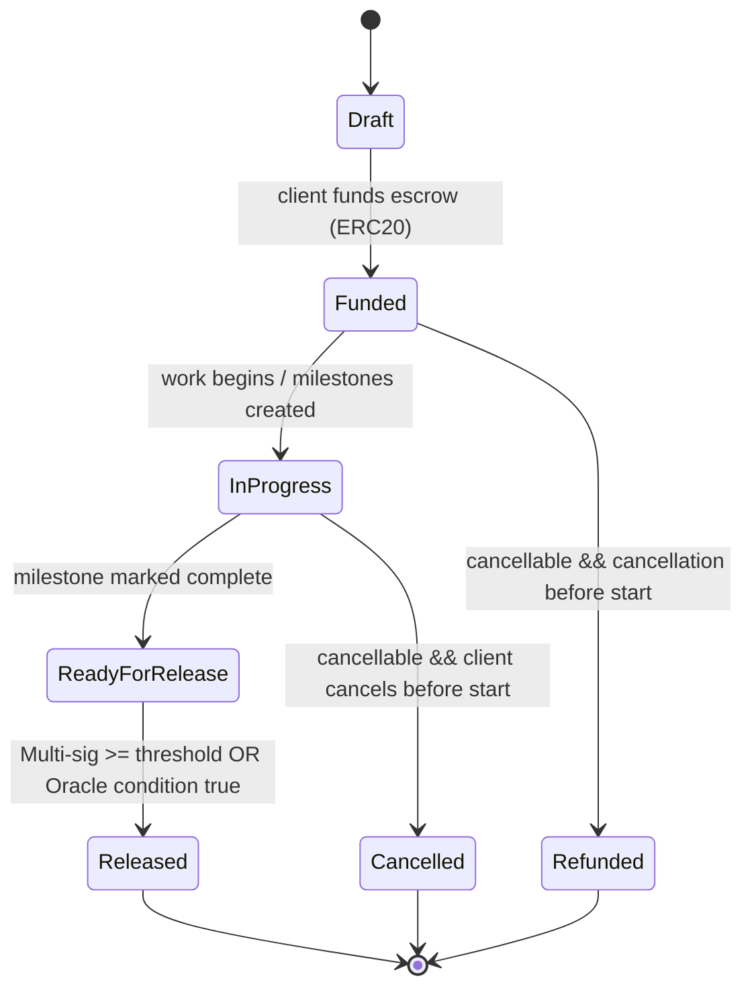

### Example (2-of-3 model)
- **Client**, **Freelancer**, and **SynLedger Arbitration Address** are all signers.
- The escrow contract requires at least **two of the three** to approve a release before it executes.

### Process
1. Client and freelancer agree the work is complete.  
2. Each signs an approval message (on-chain or via EIP-712 off-chain signature).  
3. Once the threshold (e.g., 2-of-3) is reached, the contract executes `releaseFunds()`.

### Benefits
- Prevents unilateral fund releases.  
- Increases transparency and security.  
- No single party can cheat or lock funds unfairly.

### Implementation in SynLedger
- **OpenZeppelin’s AccessControl** + **EIP-712 signature verification**.  
- Optional integration with **Gnosis Safe modules** for institutional use.

### Actors & Threshold (2-of-3)
<!-- ") -->
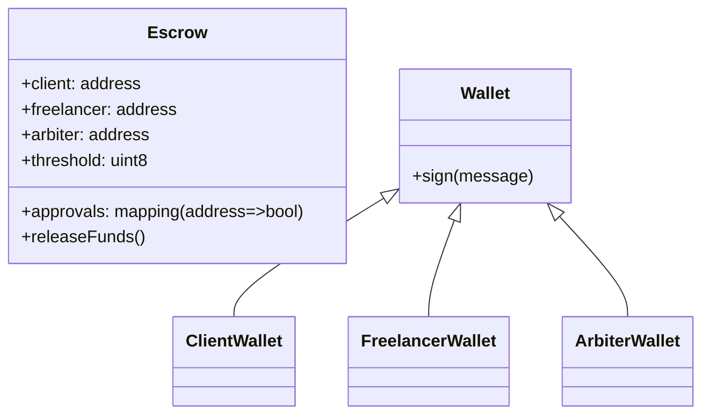

#### Sequence Flow (Signature Collection (EIP-712))
<!-- ") -->
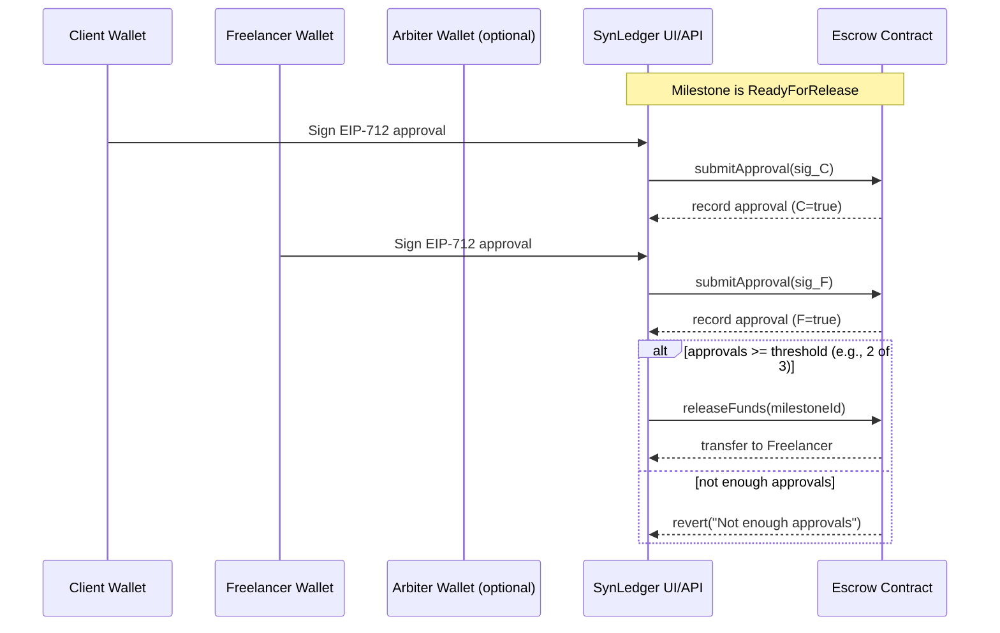

#### Decision Logic
<!--  -->
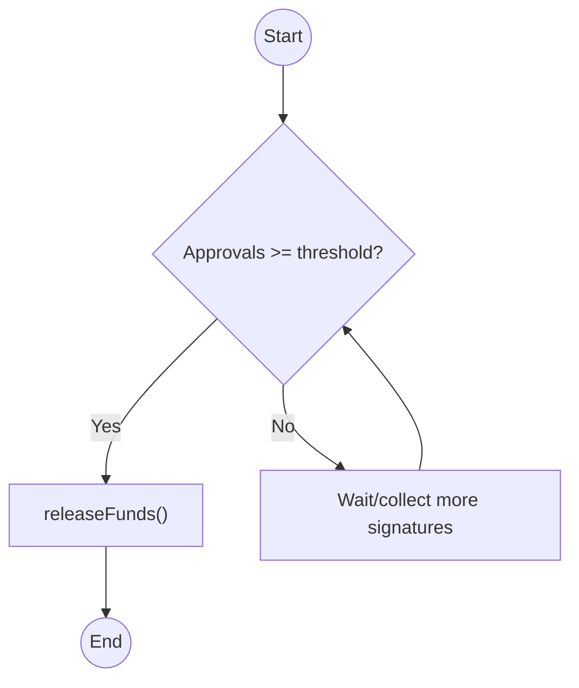
---

## 2. Auto-Release with Oracles

### Definition
An **oracle** is an on-chain data feed or service that delivers verified off-chain data to smart contracts.  
Auto-release means funds are released **automatically** when the oracle confirms a predefined condition.

#### Auto-Release with Oracles
<!--  -->
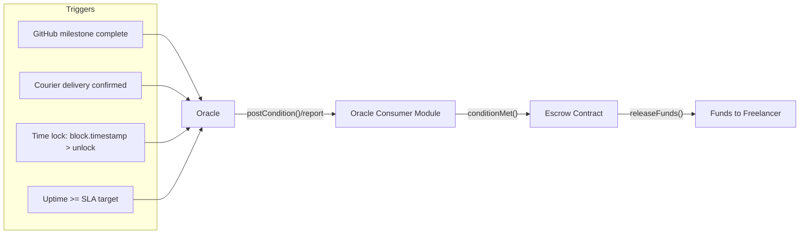

#### Release Sequence
<!-- 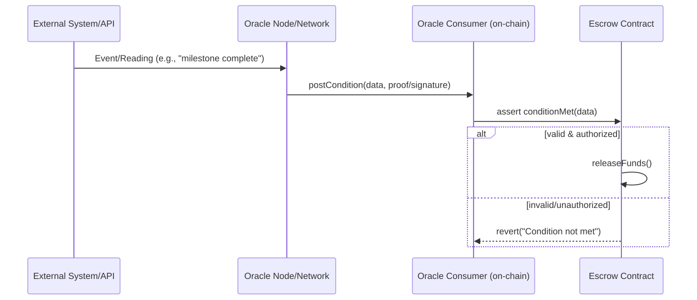 -->
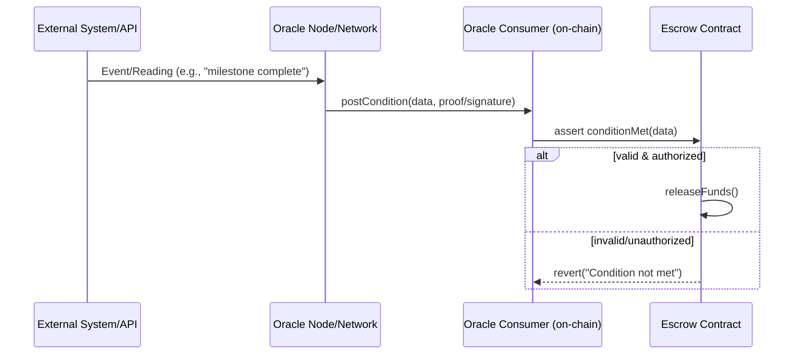

#### Authorization & Validation
<!--  -->
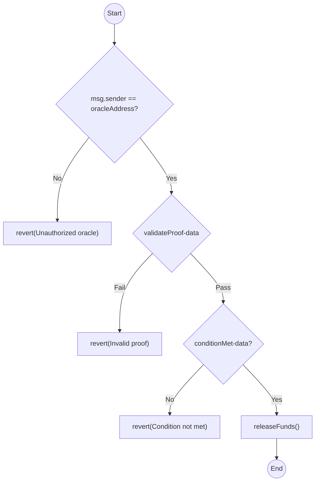

### Use Case Examples

| Use Case | Oracle Condition | Result |
|-----------|-----------------|--------|
| Freelance project | GitHub API marks milestone complete | Funds released |
| Delivery escrow | Courier API confirms delivery | Funds released |
| Time-based escrow | `block.timestamp > unlockTime` | Funds released automatically |
| Service contract | Uptime oracle verifies SLA | Funds released |

### Process
1. Oracle (e.g., Chainlink, Pyth, or SynLedger Oracle) monitors the agreed condition.  
2. When true, it posts a transaction to the contract.  
3. Contract verifies oracle signature and triggers `releaseFunds()` automatically.

### Benefits
- Removes manual approval for objective events.  
- Enables **“smart automation”** for milestone-based or recurring payments.  
- Reduces friction and human error.

---

## 3. Hybrid Mode (Oracle Trigger + Multi-Sig Fallback)
#### Authorization & Validation
<!--  -->
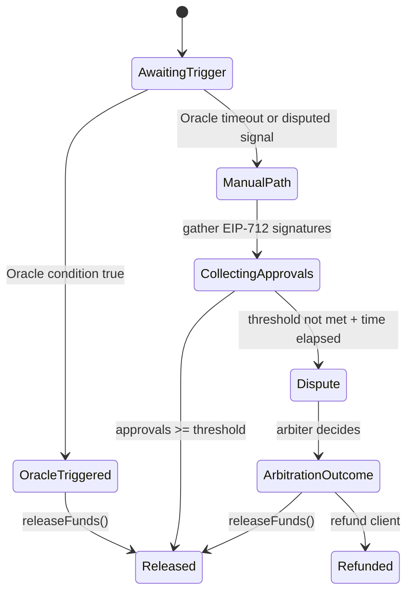

## 🧠 Why SynLedger Supports Both

SynLedger supports **both systems** for flexibility:

| Use Case | Recommended Mode |
|-----------|------------------|
| Freelance work | Multi-sig approval |
| On-chain dev bounties | Oracle-based auto-release |
| Marketplaces | Hybrid (Oracle trigger + Multi-sig fallback) |
| Automated uptime payments | Oracle auto-release |

This dual approach means SynLedger can fit:
- manual, human-verified agreements, and  
- fully automated smart contract workflows.

#### Why Support Both
<!--  -->
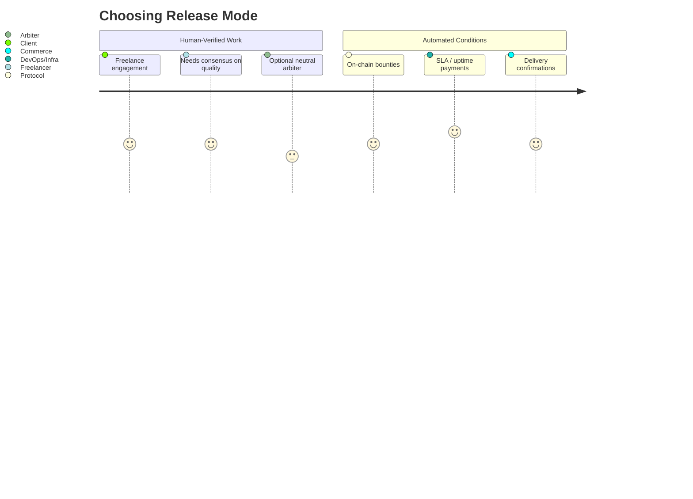

#### Security & Safeguards (Both Modes)
<!-- ") -->
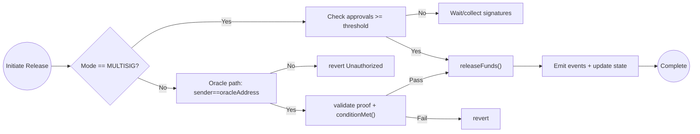

---

## Summary

| Term | Meaning | Benefit |
|------|----------|----------|
| **Multi-sig approval** | Requires two or more parties to sign before releasing funds | Guarantees consensus and fairness |
| **Auto-release with oracles** | Automatically triggers payout when a verified condition is met | Enables automation and efficiency |
| **Why it matters** | SynLedger supports both manual trust and automated logic | Fits diverse user needs |
